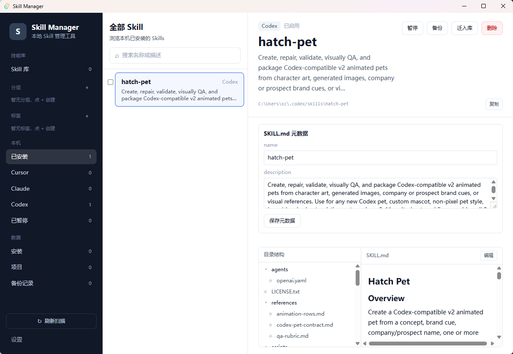
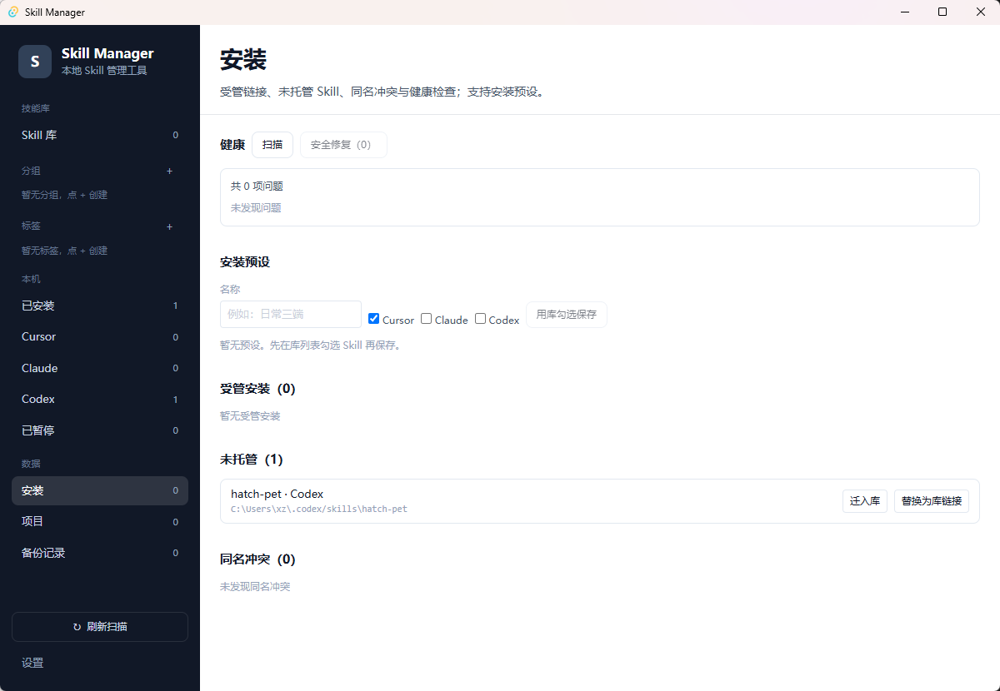
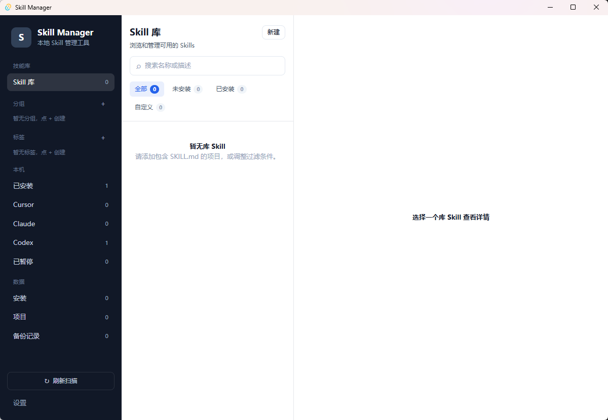
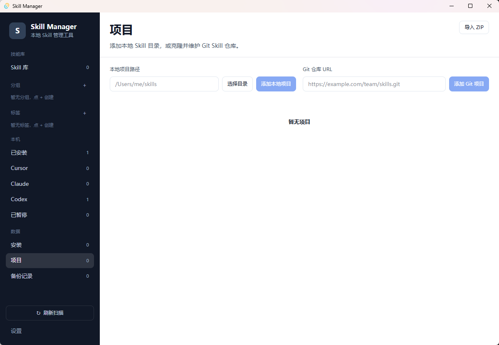
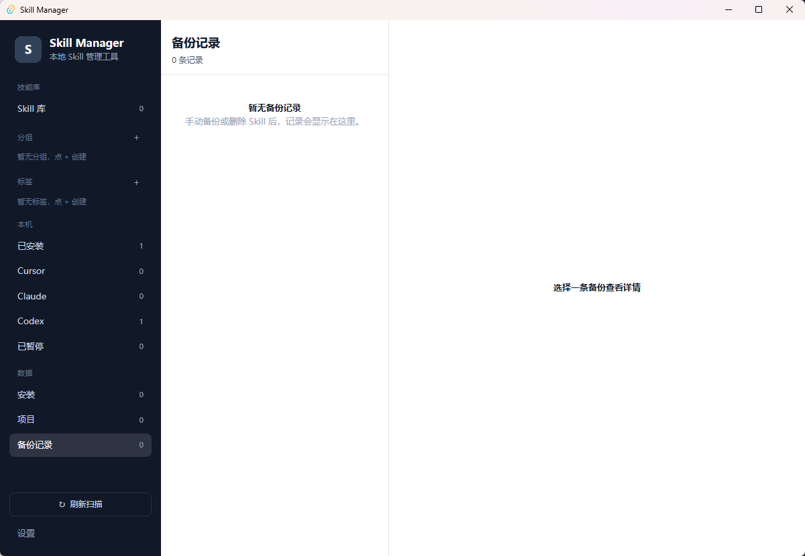
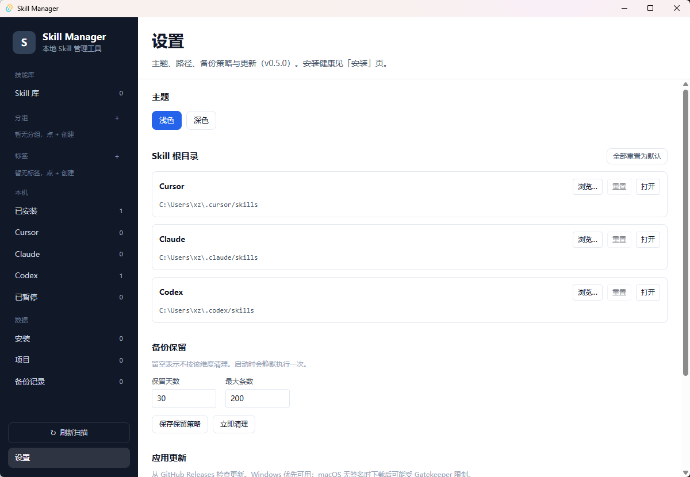

# Skilltools

本地 Skill 管理桌面应用（Skill Manager）。

## 项目概述

Skill Manager 用于管理 Cursor / Claude / Codex 本机 Skill，以及中央 Skill 库的安装、分组与备份。

- **应用标识**：`com.skilltools.manager`
- **应用数据目录**：由 Tauri `app_data_dir()` 决定（Windows 通常为 `%APPDATA%\com.skilltools.manager`）
- **默认 Skill 根目录**：`~/.cursor/skills`、`~/.claude/skills`、`~/.codex/skills`（可在设置中覆盖）

## 界面预览

三栏布局：左侧导航、中间列表、右侧详情。

| 本机 Skill 详情 | 安装总览 |
| --- | --- |
|  |  |

| Skill 库 | 项目 |
| --- | --- |
|  |  |

| 备份记录 | 设置 |
| --- | --- |
|  |  |

- **本机 Skill**：扫描 Cursor / Claude / Codex，支持暂停、备份、迁入库、文件预览与 `SKILL.md` 元数据编辑（选中 `SKILL.md` 时显示）
- **安装**：受管链接、未托管 Skill、健康扫描/安全修复、安装预设
- **Skill 库 / 项目**：中央库管理、本地或 Git 项目、ZIP 导入导出
- **设置**：主题、预览字体、根目录覆盖、备份保留策略、检查更新
- **布局**：侧栏、中间列表、目录结构可折叠展开

## 功能特性

- 三栏界面管理本机已安装 Skill 与中央库（侧栏 / 列表 / 目录树可折叠）
- 库内 Skill 新建 / 重命名 / 删除（删前卸载安装；仅删 `library_dir` 内源）
- 库安装使用受管符号链接；冲突不覆盖
- 安装总览（安装列表、健康扫描与安全修复）
- 暂停/恢复、手动备份、删除前自动备份
- 本机 Skill 复制迁入中央库（可选替换为库链接）
- 后端批量操作（部分成功 / skipped；破坏性操作需确认）
- ZIP 导入导出、应用内文件编辑
- 备份保留策略（按天 / 按数量）与应用内检查更新
- 安装总览（受管 / 未托管 / 同名冲突 / 健康）与安装预设
- Git 拉取变更摘要（新增 / 移除 / 变更）
- 文件预览：Markdown 渲染、代码高亮与行号、纯文本；设置中配置预览字体/字号
- SKILL.md 元数据：标准字段与自定义键值按需添加，空字段默认不展示

## 技术栈

| 层级 | 技术 |
|------|------|
| 桌面框架 | Tauri 2 |
| 前端 | React + TypeScript + Vite |
| 后端 | Rust |
| 测试 | Vitest + Testing Library + Cargo tests |

## 快速开始

```bash
cd app
npm install
npm run tauri dev
```

### 测试

```bash
npm run test
npm run typecheck
cd src-tauri && cargo test
```

## 安全不变量

- 路径白名单（含设置中的根目录覆盖）
- 冲突不覆盖
- 库安装 = 受管符号链接
- 破坏性操作走事务锁 + 索引原子写

## 自动更新（发布）

更新源为 GitHub Releases 的 `latest.json`。CI 需配置 Secrets：

- `TAURI_SIGNING_PRIVATE_KEY`：与 `tauri.conf.json` 中 `plugins.updater.pubkey` 对应的私钥全文
- `TAURI_SIGNING_PRIVATE_KEY_PASSWORD`：可选

### macOS 安装（未签名）

拖到「应用程序」后，若提示已损坏或无法打开，终端执行：

```bash
sudo codesign --force --deep --sign - /Applications/Skill\ Manager.app
```

然后到「系统设置 → 隐私与安全性」点「仍要打开」或「允许」。覆盖安装后再拦，重复这两步。

## 路线图

- [x] 应用内文件编辑
- [x] ZIP 导入导出
- [x] 批量操作（后端协议 + 安全确认）
- [x] 安装健康检查 / 迁入库
- [x] 库 Skill 生命周期与安装总览
- [x] 备份保留策略
- [x] 自动更新（依赖 Releases 签名配置）
- [x] 安装图统一 / 安装预设 / Git 拉取摘要 / SKILL.md 元数据
- [x] 预览字体设置、文件预览增强、布局折叠、元数据按需字段
- [ ] 在线技能市场
- [ ] 云同步（可选）
- [ ] Git 多分支 / 冲突合并 UI

## 相关文档

- [Skill Manager 实施计划](docs/superpowers/plans/2026-08-06-skill-manager.md)
- [Skill Manager 技术方案](docs/superpowers/specs/2026-08-06-skill-manager-design.md)
